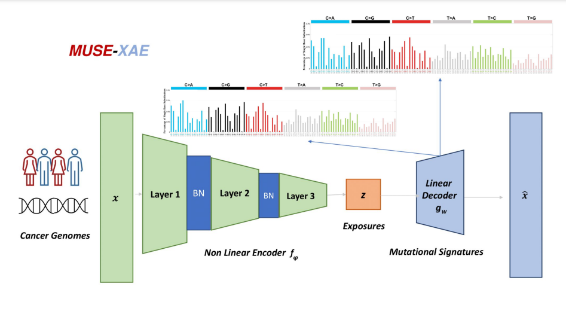
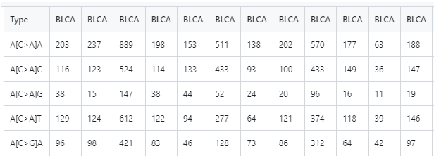
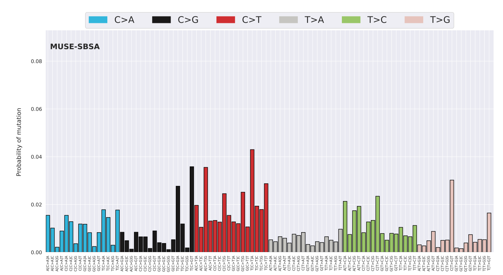
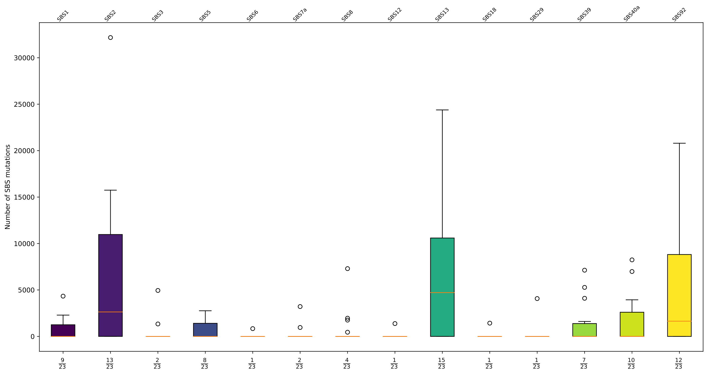

# MUtational Signatures Extraction with eXplainable AutoEncoder

MUSE-XAE is a user-friendly tool powered by the robust capabilities of autoencoder neural networks, allowing for the extraction and visualization of SBS mutational signatures present in a tumor catalog. MUSE-XAE consists of a hybrid denoising autoencoder with a nonlinear encoder that enables learning of nonlinear interactions and a linear decoder that ensures interpretability. Based on the experiments, MUSE-XAE has proven to be one of the best performing and accurate tools in extracting mutational signatures. To delve deeper into its workings, please read the related paper.

## Instructions

After downloading the repository we suggest to create a conda environment with python 3.10 and 1.24.3 numpy consequently install the requirement libraries via pip, folliwing the step:

- Create the environment: `conda create -n MUSE_env python=3.10 numpy=1.24.3`

- Activate the environment: `conda activate MUSE_env `

- Installing other libraries: `pip install -r requirements.txt`

## Availability

MUSE-XAE is currently available through GitHub and the code runs only on CPUs, 
but it will soon be available as an installable Python package and will be able to run on GPUs.

MUSE-XAE is constituted by to main modules: `MUSE-XAE De-Novo Extraction` and `MUSE-XAE Refitting`

## Input Data 

In general both `MUSE-XAE De-Novo Extraction` and `MUSE-XAE Refitting` modules assumes that the input tumor catalog is in .csv o .txt (with tab separated) format.
The tumour catalogue `M` should be a `96xN` matrix where `N` is the number of tumours and `96` is the number of `SBS mutational classes`.
MUSE-XAE assumes that 96 mutational classes order is the one of `COSMIC`. If you want to use a different order in your catalogue please add a `Type` column with the desired order.
Finally put your `dataset` in the datasets folder. To have an idea of the input file structure you can find some examples in the `datasets` folder. 
In the following image we show the first five rows of the example dataset for simplicity. 

All the synthetic datasets reported in this repo and used in the paper are taken from `Uncovering novel mutational signatures by de novo extraction with SigProfilerExtractor` from Islam et al. [[1]](https://doi.org/10.1016/j.xgen.2022.100179). Links are provided in the reproducibility notebook inside the notebook folder. 

## Refitting with known Mutational Signatures

`MUSE-XAE Refitting` module perform a consensus refitting made by `10` repetitions of MUSE-XAE refitting algorithm to increase robustness and
reliability of assignment.

To `Refit` COSMIC signatures to an `Example` dataset run the following:

`python ./MUSE-XAE/main.py --dataset Example --refit_only True`

By default the reference set is the `COSMIC v3.4` SBS signatures. If you want to add your own reference set use 
`--reference_set Signatures_set` to the previous line.
You need to be sure that your `Signatures_set` is in the `dataset` folder.
We suggest to use the `default` parameters but you can also specifiy the following parameters:

- `--dataset`: **(Required)** Dataset name.
- `--refit_regularizer`: Refit Penalty type. Default is `l1`
- `--refit_penalty`: Refit Penalty amount. Default is `0.003`
- `--refit_loss`: Refit Loss function. Default is `mae`
- `--reference_set`: Signature Set to Refit. Default is `COSMIC_SBS_GRCh37_3.4`
- `--remove_artefact`: Remove known artefact. Default is `True`
- `--refit_patience`: Patience before stopping the refitting. Default is `200`
- `--n_jobs`: Number of cpu to use in parallel. Default is `12`

## De-Novo Extraction of Mutational Signatures 

`MUSE-XAE De-Novo Extraction` module perform De-Novo Extraction of mutational signatures and then uses `MUSE-XAE Refitting` module
to assign mutations to the extracted signatures.

For a quick test to extract mutational signatures with default parameters on an `Example` dataset run the following:

`python ./MUSE-XAE/main.py --dataset Example --min_sig 2 --max_sig 5 --iter 5 --augmentation 10`

For the standard usage we suggest to use `default` parameters choosen based on experiments.
All the optional arguments are listed below:

- `--dataset`: **(Required)** Dataset name.
- `--augmentation`: Number of times of data augmentation. Default is `100`.
- `--iter`: Number of repetitions for clustering. Default is `100`.
- `--max_sig`: Max signatures to explore. Default is `25`.
- `--min_sig`: Min signatures to explore. Default is `2`.
- `--batch_size`: Batch Size. Default is `64`.
- `--epochs`: Number of epochs. Default is `1000`.
- `--run`: Parameter for multiple runs to test robustness.
- `--mean_stability`: Average Stability for accepting a solution. Default is `0.7`.
- `--min_stability`: Minimum Stability of a Signature to accept a solution. Default is `0.2`.
- `--directory`: Main Directory to save results. Default is `./`.
- `--loss`: Loss function to use in the autoencoder. Default is `poisson`.
- `--activation`: Activation function. Default is `softplus`.
- `--n_jobs`: number of parallel jobs. Default is `24`.
- `--cosmic_version`: Cosmic version reference. Default is `3.4` .

## Output data

Running `MUSE-XAE` will generate an `Experiments` (or a directory specified by the user) directory
with subfolders.

For the `MUSE-XAE De-Novo Extraction`  module in `Plots` folder
you will find the extracted signatures profile

### Mutational Signature profile

For both `MUSE-XAE De-Novo Extraction` and `MUSE-XAE De-Novo Refitting` you will also find
the distribution of exposures in all samples and how each signatures contribute to mutations in each samples.

### Signature contribution

### Exposures distribution

## References

- Uncovering novel mutational signatures by de novo extraction with SigProfilerExtractor, Islam et al. [DOI](https://doi.org/10.1016/j.xgen.2022.100179)
- The Cancer Genome Atlas Research Network., Weinstein, J., Collisson, E. et al. The Cancer Genome Atlas Pan-Cancer analysis project. Nat Genet 45, 1113–1120 (2013) [DOI](https://doi.org/10.1038/ng.2764)
- Signal: The home page of mutational signatures. S. Shooter, J. Czarnecki, S. Nik-Zainal [DOI](https://doi.org/10.1038/ng.2764)

